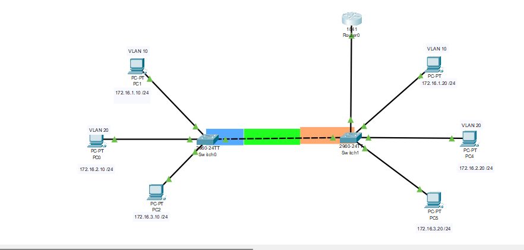

---

# VLAN and Trunking Lab (Cisco Packet Tracer)

This is a beginner-friendly Cisco Packet Tracer project focused on understanding the basic concepts of **VLANs**, **trunking**, and **inter-VLAN communication** in a network environment.

## 🔍 Project Overview

* Created and assigned **4 VLANs** on a Layer 2 switch.
* Assigned multiple switch ports to different VLANs.
* Configured **inter-VLAN communication** using a **router-on-a-stick** setup.
* Set up trunk links between switches and the router to allow tagged VLAN traffic.
* Devices in different VLANs can now successfully communicate through the router.

## 🧠 Learning Objectives

* Understand how to segment a network using VLANs.
* Get hands-on practice assigning ports to VLANs.
* Learn about trunk ports and their role in VLAN traffic tagging.
* Configure and test **inter-VLAN routing** using a Layer 3 device.

## 📁 File

* `activity1.pkt` – Packet Tracer file for this project.

## 🚀 How to Use

1. Open the `.pkt` file using [Cisco Packet Tracer](https://www.netacad.com/portal/resources/packet-tracer).
2. Explore the VLAN and trunk configurations on the switch.
3. Review the router-on-a-stick setup to understand how inter-VLAN routing is implemented.
4. Test communication between devices in different VLANs using ping or other network tools.

---

Feel free to fork, experiment, and build upon this project to enhance your networking skills!

---

Let me know if you'd like to include CLI configuration snippets or device IP addressing in the README too.
